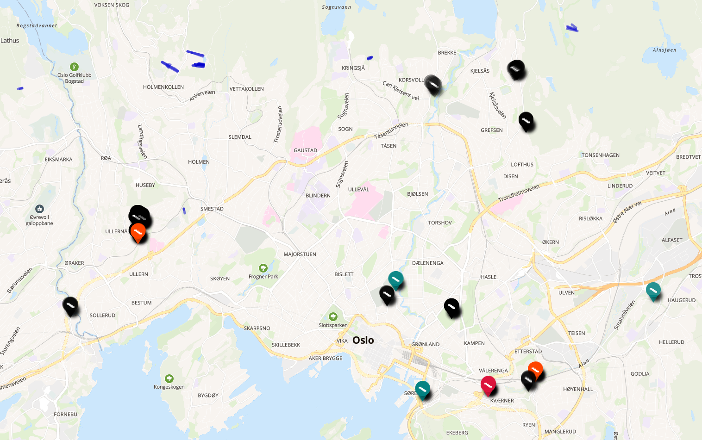

# Stair Run Finder

Run `python3 main.py <path to your .osm/.o5m/>.pbf map>`.
This will produce a `.output` folder in the same directory as main.py which contains different maps for different lengths of stairs.